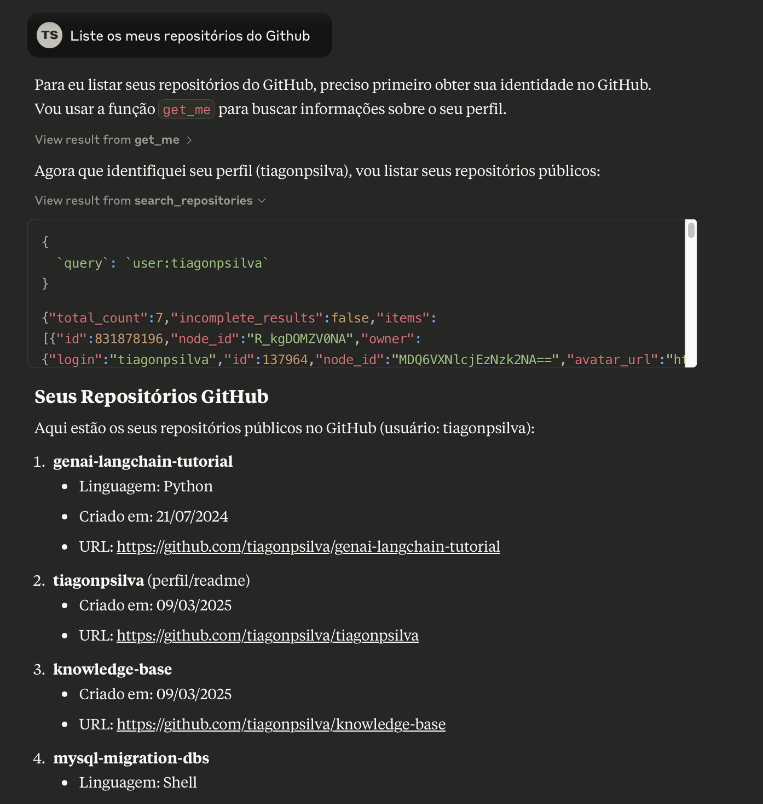
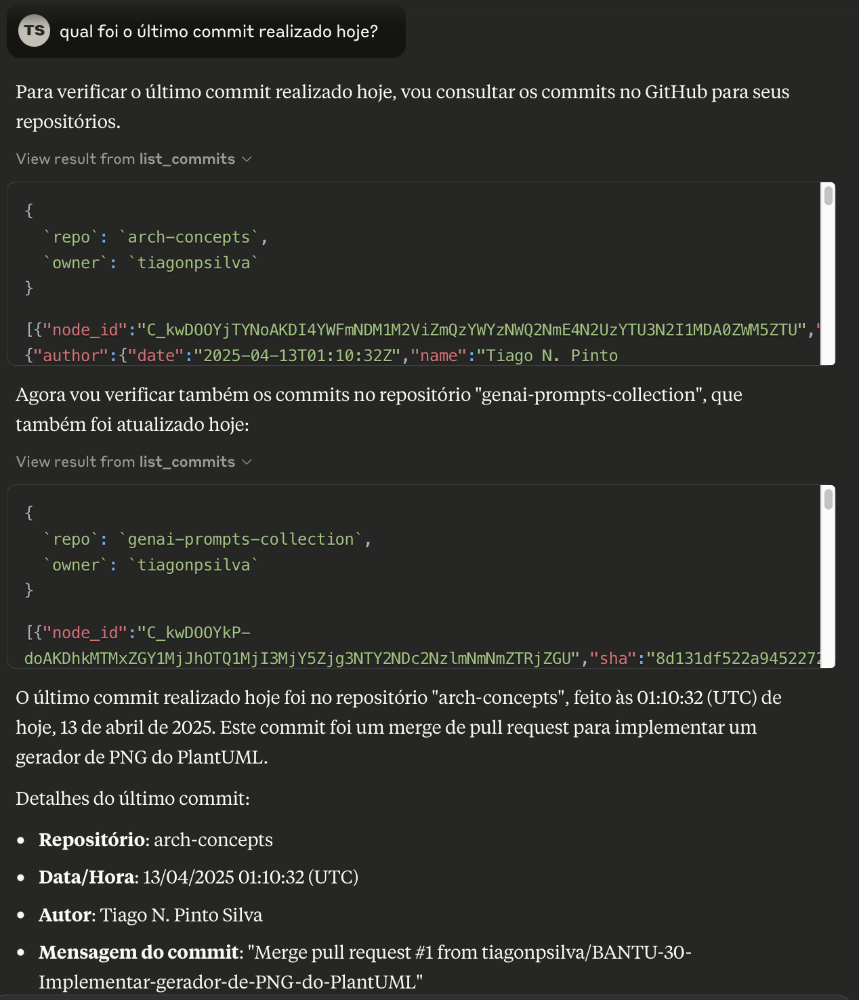
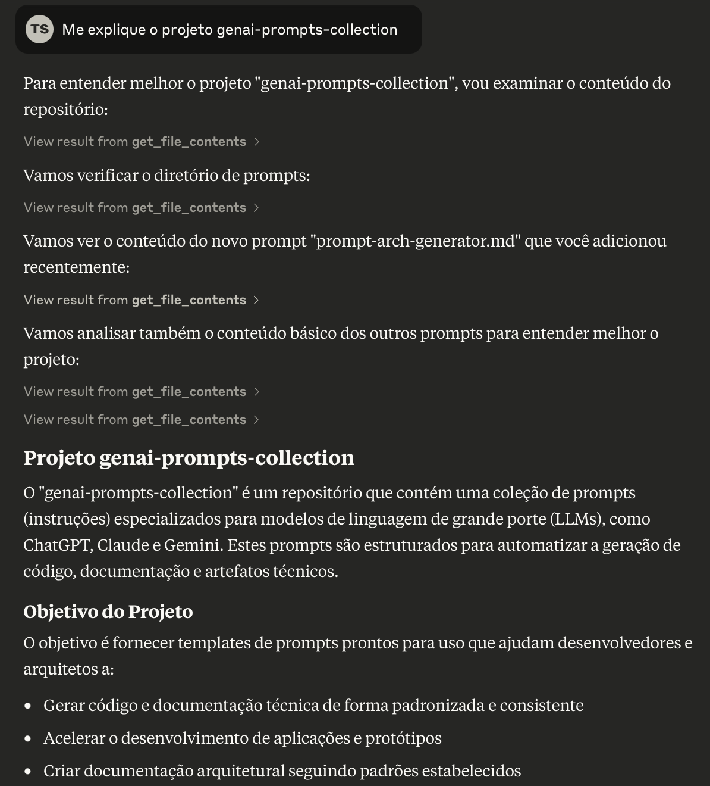
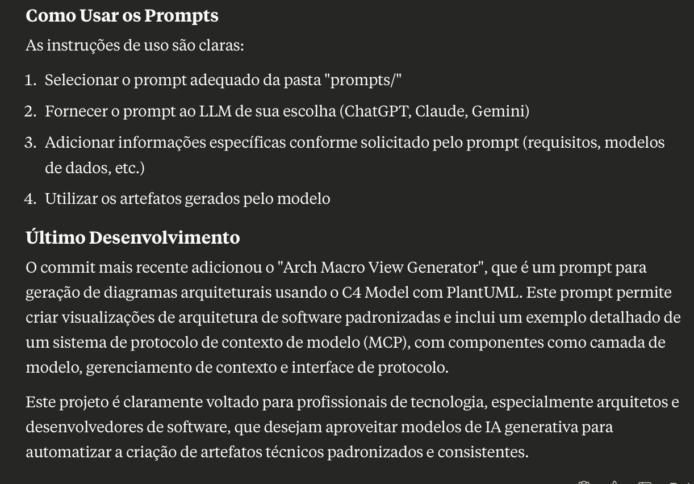

# Tutorial: Usando o GitHub MCP Server com Claude Desktop

Este tutorial demonstra a integração do GitHub com o Claude Desktop através do Model Context Protocol (MCP), usando imagens capturadas da aplicação em funcionamento.

## 1. Listando Repositórios do GitHub

**Explicação:** Nesta imagem, vemos o Claude utilizando funções do GitHub MCP para listar todos os repositórios públicos de um usuário. Primeiro, o Claude usa a função `get_me` para identificar o perfil do usuário (tiagonpsilva). 

Em seguida, ele utiliza a função `search_repositories` para buscar os repositórios vinculados a este usuário. O resultado mostra vários repositórios, incluindo:

1. genai-langchain-tutorial (Python)
2. tiagonpsilva (perfil/readme)
3. knowledge-base
4. mysql-migration-dbs (Shell)

Esta funcionalidade é particularmente útil quando você deseja ter uma visão geral dos seus projetos ou quando precisa acessar rapidamente um repositório específico sem sair da interface do Claude Desktop.

## 2. Verificando Commits Recentes

**Explicação:** Esta imagem demonstra como o Claude pode consultar commits recentes em repositórios GitHub. O usuário perguntou qual foi o último commit realizado no dia, e o Claude utilizou a função `list_commits` para buscar essa informação.

A imagem mostra que o Claude identificou um commit realizado às 01:10:32 (UTC) de 13 de abril de 2025 no repositório "arch-concepts". Este commit foi um merge de pull request para implementar um gerador de PNG do PlantUML, enviado pelo autor Tiago N. Pinto Silva.

O Claude também verificou commits no repositório "genai-prompts-collection", demonstrando como ele pode acompanhar atividades em múltiplos repositórios simultaneamente, tudo através da interface do MCP.

## 3. Instruções de Uso dos Prompts

**Explicação:** Esta imagem mostra as instruções de uso dos prompts disponíveis no repositório "genai-prompts-collection". O processo é dividido em quatro passos simples:

1. Selecionar o prompt adequado da pasta "prompts/"
2. Fornecer o prompt ao LLM de escolha (ChatGPT, Claude, Gemini)
3. Adicionar informações específicas conforme solicitado pelo prompt
4. Utilizar os artefatos gerados pelo modelo

A imagem também detalha um desenvolvimento recente: a adição do "Arch Macro View Generator", um prompt para geração de diagramas arquiteturais usando o C4 Model com PlantUML. É interessante notar que este prompt inclui um exemplo detalhado relacionado ao Model Context Protocol (MCP), mostrando componentes como camada de modelo, gerenciamento de contexto e interface de protocolo.

## 4. Explorando um Repositório com Claude

**Explicação:** Nesta imagem, vemos o Claude Desktop analisando um repositório chamado "genai-prompts-collection". O usuário pediu ao Claude para explicar o projeto, e ele está explorando a estrutura do repositório usando a função `get_file_contents`. O Claude está navegando pelo diretório de prompts e acessando o conteúdo de arquivos específicos, incluindo um prompt recém-adicionado chamado "prompt-arch-generator.md".

Na parte inferior da imagem, Claude apresenta uma explicação detalhada do projeto, descrevendo-o como uma coleção de prompts (instruções) especializados para modelos de linguagem de grande porte (LLMs) como ChatGPT, Claude e Gemini. Esses prompts são estruturados para automatizar a geração de código, documentação e artefatos técnicos.

## Conclusão

Estas imagens demonstram como a integração do GitHub MCP Server com o Claude Desktop permite uma interação natural com repositórios GitHub, incluindo:

- Exploração de conteúdo e estrutura de repositórios
- Análise de código e documentação
- Verificação de histórico de commits
- Listagem e gerenciamento de repositórios

A integração facilita significativamente o fluxo de trabalho para desenvolvedores, permitindo que consultem e interajam com seus projetos GitHub sem sair da interface do Claude, usando linguagem natural para navegar e extrair informações.